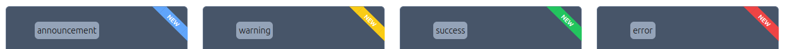

<div align="center">
  <h3 align="center">React Ribbon UI</h3>
  
  <p align="center">
    React Ribbon component to enrich your UI
    <br />
    <br />
    
    <br />
    <br />
    <a href="https://github.com/token-ed/react-ribbon-ui"><strong>Explore the docs »</strong></a>
    <br />
    <br />
    <a href="https://token-ed.github.io/react-ribbon-ui/" target="_blank">View Demo</a>
  </p>
</div>

<!-- TABLE OF CONTENTS -->
<details>
  <summary>Table of Contents</summary>
  <ol>
    <li>
      <a href="#about">About</a>
      <ul>
        <li><a href="#built-with">Built With</a></li>
      </ul>
    </li>
    <li>
      <a href="#installation">Installation</a>
      <ul>
        <li><a href="#prerequisites">Prerequisites</a></li>
      </ul>
    </li>
     <li>
      <a href="#usage">Usage</a>
      <ul>
        <li><a href="#example-1">Example 1</a></li>
        <li><a href="#example-2">Example 2</a></li>
        <li><a href="#important-note-on-tailwindcss-integration">Important Note on TailwindCSS Integration</a></li>
      </ul>
    </li>
    <li>
      <a href="#api">API</a>
      <ul>
        <li><a href="#props">Props</a></li>
      </ul>
    </li>
    <li><a href="#license">License</a></li>
    <li><a href="#todo">TODO</a></li>
  </ol>
</details>

<!-- ABOUT THE PROJECT -->

## About

The `Ribbon` component is a versatile UI element that displays a ribbon with customizable `text`, `position`, and opinionanted variant colors. This component can be used to highlight new features, display error messages, or indicate success. You can use this ribbon component on a "trap" element (more on this in [usage](#usage) section). Only supports `Tailwind` projects.

### Built With

- [![React][React.js]][React-url]
- [![TypeScript][TypeScript]][TypeScript-url]
- [![Tailwind][Tailwind]][Tailwind-url]

<!-- GETTING STARTED -->

## Installation

### Prerequisites

- npm

  ```sh
  npm install react-ribbon-ui@latest
  ```

- yarn
  ```sh
  yarn install react-ribbon-ui@latest
  ```

<!-- USAGE EXAMPLES -->

## Usage

In order to use the `Ribbon` component and show it correctly on the UI, it is necessary to trap it within a `relative`-positioned element. `Ribbon` will always stick to the neareast `relative`-positioned element. This package provides a `RibbonWrapper` that you can import into your project and use it out of the box as shown in Example 1.

### Example 1

```tsx
<RibbonWrapper>
  <Ribbon text="NEW" position="top-right" variant="announcement" />
  <p>Your Content</p>
</RibbonWrapper>
```

However, because you may want to have Tailwind compute through your classes and get automatic suggestions (or you want to render an HTML element for accesibility/SEO reasons) , you can also create your custom element, but do remember to always apply a `relative` class name to it, otherwise the ribbon will stick to the closest positioned ancestor, which most certainly is not what you want.

### Example 2

```tsx
<div className="relative">
  <Ribbon text="NEW" position="top-right" variant="announcement" />
  <p>Your Content</p>
</div>
```

### Important Note on Next.js Integration

There is a change you are using Next.js framework to build your project. If that is the case please add this configuration line to your `next.config.mjs` file:

```ts
/** @type {import('next').NextConfig} */
const nextConfig = { transpilePackages: ["react-ribbon-ui"] }; // add this line

export default nextConfig;
```

This will ensure Next.js transpiles and bundles dependencies from this package into your project out of the box.

For more information refer to: https://nextjs.org/docs/app/api-reference/next-config-js/transpilePackages

### Important Note on TailwindCSS Integration

As of the date of publishing this package, TailwindCSS does not support native package resolution for styles. This means that any custom styling provided by this package using TailwindCSS will not automatically be included in your project. To ensure that the TailwindCSS styles from this package are applied correctly, you need to update your TailwindCSS configuration in your project.

Please follow these steps (assuming you've already installed TailwindCSS and created a configuration file):

1. **Update your tailwind.config.js file** to include the paths to the components of this package:

```js
/** @type {import('tailwindcss').Config} */
module.exports = {
  content: [
    ...
    "./node_modules/react-ribbon-ui/**/*.{js,ts,jsx,tsx}", // Add this line,
    ...
  ],
};
```

For more information refer to: https://tailwindcss.com/docs/content-configuration#working-with-third-party-libraries

<p align="right">(<a href="#readme-top">back to top</a>)</p>

## API

### Props

| Prop        | Type                                                               | Description                                                                                                            | Default        |
| ----------- | ------------------------------------------------------------------ | ---------------------------------------------------------------------------------------------------------------------- | -------------- |
| `text`      | `string`                                                           | The text to display inside the ribbon. This is a required prop.                                                        | -              |
| `position`  | `"top-left" \| "top-right" \| "bottom-right" \| "bottom-left"`     | The position of the ribbon. Possible values are `"top-left"`, `"top-right"`, `"bottom-right"`, and `"bottom-left"`.    | `"top-left"`   |
| `textColor` | `string`                                                           | The text color. This should be a valid Tailwind color class.                                                           | `"text-white"` |
| `variant`   | `"warning" \| "error" \| "success" \| "announcement" \| "default"` | The variant of the ribbon. Possible values are `"warning"`, `"error"`, `"success"`, `"announcement"`, and `"default"`. | `"default"`    |

<!-- LICENSE -->

## License

MIT

<!-- ACKNOWLEDGMENTS -->

## TODO

This is an ongoing development as it is a very basic component so there may be some features that you may think should have been added already and work out of the box. Here is some a few improvements that will be added soon:

- Add two more sizes to the ribbon (medium, big)
- Add stripes to the ribbon and let the consumer control it through props
- Add custom control over the background color from the consumer
- Add capability of having gradient colors

[TypeScript]: https://img.shields.io/badge/TypeScript-3178C6?style=for-the-badge&logo=typescript&logoColor=white
[Tailwind]: https://img.shields.io/badge/tailwindcss-0F172A?&logo=tailwindcss
[React.js]: https://img.shields.io/badge/React-20232A?style=for-the-badge&logo=react&logoColor=61DAFB
[React-url]: https://react.dev/
[TypeScript-url]: https://www.typescriptlang.org/
[Tailwind-url]: https://tailwindcss.com/
